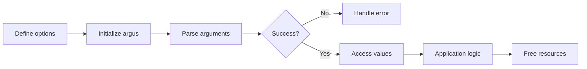

# Quick Start

This guide will help you quickly create a simple application using argus to process command-line arguments.

## Minimal Example

Here's a minimal example of using argus:

```c
#include "argus.h"
#include <stdio.h>

// Define options
ARGUS_OPTIONS(
    options,
    HELP_OPTION(FLAGS(FLAG_EXIT)),
    VERSION_OPTION(FLAGS(FLAG_EXIT)),
    OPTION_FLAG('v', "verbose", HELP("Enable verbose mode"))
)

int main(int argc, char **argv)
{
    // Initialize argus
    argus_t argus = argus_init(options, "my_program", "1.0.0");
    
    // Parse arguments
    int status = argus_parse(&argus, argc, argv);
    if (status != ARGUS_SUCCESS) {
        return status;
    }
    
    // Access parsed values
    bool verbose = argus_get(argus, "verbose").as_bool;
    
    // Application logic
    if (verbose) {
        printf("Verbose mode enabled\n");
    }
    
    // Free resources
    argus_free(&argus);
    return 0;
}
```

## Fundamental Steps

!!! abstract "Process"
    Here are the essential steps to use argus in your application:

    1. **Include the header**: Start by including the `argus.h` header.
    2. **Define options**: Use the `ARGUS_OPTIONS` macro to define the options accepted by your program.
    3. **Initialize argus**: Call `argus_init()` to initialize the argus context.
    4. **Parse arguments**: Use `argus_parse()` to parse the command-line arguments.
    5. **Access values**: Use `argus_get()`, `argus_is_set()` and other functions to access option values.
    6. **Free resources**: Call `argus_free()` before exiting to release allocated resources.

## Option Types

Argus supports several types of options that you can use in your application:

| Type | Macro | Description | Example |
|------|-------|-------------|---------|
| **Flag** | `OPTION_FLAG` | Boolean option (presence/absence) | `OPTION_FLAG('v', "verbose", "Verbose mode")` |
| **Boolean** | `OPTION_BOOL` | Boolean option with true/false value | `OPTION_BOOL('d', "debug", "Debug mode")` |
| **String** | `OPTION_STRING` | Option with string value | `OPTION_STRING('o', "output", "Output file")` |
| **Integer** | `OPTION_INT` | Option with integer value | `OPTION_INT('p', "port", "Port number")` |
| **Float** | `OPTION_FLOAT` | Option with floating-point value | `OPTION_FLOAT('f', "factor", "Scale factor")` |
| **Positional** | `POSITIONAL_*` | Positional argument | `POSITIONAL_STRING("input", "Input file")` |
| **Subcommand** | `SUBCOMMAND` | Subcommand with its own options | `SUBCOMMAND("add", add_options, ...)` |
| **Array** | `OPTION_ARRAY_*` | Option with multiple values | `OPTION_ARRAY_STRING('i', "input", "Input files")` |
| **Map** | `OPTION_MAP_*` | Option with key-value pairs | `OPTION_MAP_STRING('m', "map", "Key-value pairs")` |

## Complete Example

Here's a more complete example including different types of options:

=== "Options Definition"
    ```c
    ARGUS_OPTIONS(
        options,
        HELP_OPTION(FLAGS(FLAG_EXIT)),
        VERSION_OPTION(FLAGS(FLAG_EXIT)),
        OPTION_FLAG('v', "verbose", HELP("Enable verbose mode")),
        OPTION_STRING('o', "output", HELP("Output file"), DEFAULT("output.txt")),
        OPTION_INT('c', "count", HELP("Number of iterations"), RANGE(1, 100), DEFAULT(10)),
        OPTION_FLOAT('f', "factor", HELP("Scale factor"), DEFAULT(1.0)),
        POSITIONAL_STRING("input", HELP("Input file"))
    )
    ```

=== "Main Code"
    ```c
    #include "argus.h"
    #include <stdio.h>
    #include <stdlib.h>

    // Options definition (see previous tab)

    int main(int argc, char **argv)
    {
        // Initialize argus
        argus_t argus = argus_init(options, "complete_example", "1.0.0");
        argus.description = "Complete example of argus";
        
        // Parse arguments
        int status = argus_parse(&argus, argc, argv);
        if (status != ARGUS_SUCCESS) {
            return status;
        }
        
        // Access parsed values
        const char *input = argus_get(argus, "input").as_string;
        const char *output = argus_get(argus, "output").as_string;
        int count = argus_get(argus, "count").as_int;
        double factor = argus_get(argus, "factor").as_float;
        bool verbose = argus_get(argus, "verbose").as_bool;
        
        // Display configuration
        printf("Configuration:\n");
        printf("  Input: %s\n", input);
        printf("  Output: %s\n", output);
        printf("  Count: %d\n", count);
        printf("  Factor: %.2f\n", factor);
        printf("  Verbose: %s\n", verbose ? "yes" : "no");
        
        // Free resources
        argus_free(&argus);
        return 0;
    }
    ```

=== "Compilation"
    ```bash
    gcc -o complete_example complete_example.c -largus
    ```

## Automatically Generated Help

With the `HELP_OPTION` and `VERSION_OPTION` options, argus automatically generates formatted help and version information when the user specifies `--help` or `--version`.

!!! example "Example of generated help"
    ```
    complete_example v1.0.0

    Complete example of argus

    Usage: complete_example [OPTIONS] <input>

    Arguments:
      <input>                - Input file

    Options:
      -h, --help             - Display this help message (exit)
      -V, --version          - Display version information (exit)
      -v, --verbose          - Enable verbose mode
      -o, --output <STR>     - Output file (default: "output.txt")
      -c, --count <NUM>      - Number of iterations [1-100] (default: 10)
      -f, --factor <FLOAT>   - Scale factor (default: 1.00)
    ```

## Typical Development Flow

Developing an application with argus typically follows this process:



## Next Steps

Now that you've created a basic application with argus, you can explore more advanced features:

- [Basic Options](basic-options.md) - Learn more about different option types
- [Subcommands](subcommands.md) - Create applications with subcommands like Git or Docker
- [Validation](validation.md) - Validate user input with built-in or custom validators
