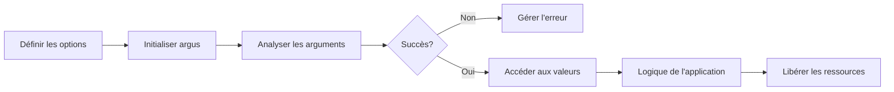

# Démarrage rapide

Ce guide vous aidera à créer rapidement une application simple utilisant argus pour traiter les arguments de ligne de commande.

## Exemple minimal

Voici un exemple minimal d'utilisation de argus :

```c
#include "argus.h"
#include <stdio.h>

// Définir les options
ARGUS_OPTIONS(
    options,
    HELP_OPTION(),
    VERSION_OPTION(),
    OPTION_FLAG('v', "verbose", HELP("Activer le mode verbeux"))
)

int main(int argc, char **argv)
{
    // Initialiser argus
    argus_t argus = argus_init(options, "my_program", "1.0.0");
    
    // Analyser les arguments
    int status = argus_parse(&argus, argc, argv);
    if (status != ARGUS_SUCCESS) {
        return status;
    }
    
    // Accéder aux valeurs analysées
    bool verbose = argus_get(argus, "verbose").as_bool;
    
    // Logique de l'application
    if (verbose) {
        printf("Mode verbeux activé\n");
    }
    
    // Libérer les ressources
    argus_free(&argus);
    return 0;
}
```

## Étapes fondamentales

!!! abstract "Processus"
    Voici les étapes essentielles pour utiliser argus dans votre application :

    1. **Inclure l'en-tête** : Commencez par inclure l'en-tête `argus.h`.
    2. **Définir les options** : Utilisez la macro `ARGUS_OPTIONS` pour définir les options acceptées par votre programme.
    3. **Initialiser argus** : Appelez `argus_init()` pour initialiser le contexte argus.
    4. **Analyser les arguments** : Utilisez `argus_parse()` pour analyser les arguments de ligne de commande.
    5. **Accéder aux valeurs** : Utilisez `argus_get()`, `argus_is_set()` et d'autres fonctions pour accéder aux valeurs des options.
    6. **Libérer les ressources** : Appelez `argus_free()` avant de quitter pour libérer les ressources allouées.

## Types d'options

Argus prend en charge plusieurs types d'options que vous pouvez utiliser dans votre application :

| Type | Macro | Description | Exemple |
|------|-------|-------------|---------|
| **Flag** | `OPTION_FLAG` | Option booléenne (présence/absence) | `OPTION_FLAG('v', "verbose", HELP("Mode verbeux"))` |
| **Bool** | `OPTION_BOOL` | Option booléenne avec valeur saisisable | `OPTION_BOOL('d', "debug", HELP("Mode débogage"))` |
| **String** | `OPTION_STRING` | Option avec valeur de chaîne | `OPTION_STRING('o', "output", HELP("Fichier de sortie"))` |
| **Integer** | `OPTION_INT` | Option avec valeur entière | `OPTION_INT('p', "port", HELP("Numéro de port"))` |
| **Float** | `OPTION_FLOAT` | Option avec valeur à virgule flottante | `OPTION_FLOAT('f', "factor", HELP("Facteur d'échelle"))` |
| **Positional** | `POSITIONAL_*` | Argument positionnel | `POSITIONAL_STRING("input", HELP("Fichier d'entrée"))` |
| **Subcommand** | `SUBCOMMAND` | Sous-commande avec ses propres options | `SUBCOMMAND("add", add_options, ...)` |
| **Array** | `OPTION_ARRAY_*` | Option avec plusieurs valeurs | `OPTION_ARRAY_INT('a', "add", HELP("Ajouter des éléments"))` |
| **Map** | `OPTION_MAP_*` | Option avec valeurs sous forme de paires clé-valeur | `OPTION_MAP_STRING('m', "map", HELP("Mapper des valeurs"))` |

## Exemple complet

Voici un exemple plus complet incluant différents types d'options :

=== "Définition des options"
    ```c
    ARGUS_OPTIONS(
        options,
        HELP_OPTION(),
        VERSION_OPTION(),
        OPTION_FLAG('v', "verbose", HELP("Activer le mode verbeux")),
        OPTION_STRING('o', "output", HELP("Fichier de sortie"), DEFAULT("output.txt")),
        OPTION_INT('c', "count", HELP("Nombre d'itérations"), RANGE(1, 100), DEFAULT(10)),
        OPTION_FLOAT('f', "factor", HELP("Facteur d'échelle"), DEFAULT(1.0)),
        POSITIONAL_STRING("input", HELP("Fichier d'entrée"))
    )
    ```

=== "Code principal"
    ```c
    #include "argus.h"
    #include <stdio.h>
    #include <stdlib.h>

    // Définition des options (voir l'onglet précédent)

    int main(int argc, char **argv)
    {
        // Initialiser argus
        argus_t argus = argus_init(options, "complete_example", "1.0.0");
        argus.description = "Exemple complet de argus";
        
        // Analyser les arguments
        int status = argus_parse(&argus, argc, argv);
        if (status != ARGUS_SUCCESS) {
            return status;
        }
        
        // Accéder aux valeurs analysées
        const char *input = argus_get(argus, "input").as_string;
        const char *output = argus_get(argus, "output").as_string;
        int count = argus_get(argus, "count").as_int;
        double factor = argus_get(argus, "factor").as_float;
        bool verbose = argus_get(argus, "verbose").as_bool;
        
        // Afficher la configuration
        printf("Configuration :\n");
        printf("  Entrée : %s\n", input);
        printf("  Sortie : %s\n", output);
        printf("  Compteur : %d\n", count);
        printf("  Facteur : %.2f\n", factor);
        printf("  Verbeux : %s\n", verbose ? "oui" : "non");
        
        // Libérer les ressources
        argus_free(&argus);
        return 0;
    }
    ```

=== "Compilation"
    ```bash
    gcc -o complete_example complete_example.c -largus
    ```

## Aide générée automatiquement

Avec les options `HELP_OPTION` et `VERSION_OPTION`, argus génère automatiquement des informations d'aide et de version formatées lorsque l'utilisateur spécifie `--help` ou `--version`.

!!! example "Exemple d'aide générée"
    ```
    complete_example v1.0.0

    Exemple complet de argus

    Usage: complete_example [OPTIONS] <input>

    Arguments:
      <input>                - Fichier d'entrée

    Options:
      -h, --help             - Afficher ce message d'aide (exit)
      -V, --version          - Afficher les informations de version (exit)
      -v, --verbose          - Activer le mode verbeux
      -o, --output <STR>     - Fichier de sortie (défaut : "output.txt")
      -c, --count <NUM>      - Nombre d'itérations [1-100] (défaut : 10)
      -f, --factor <FLOAT>   - Facteur d'échelle (défaut : 1.00)
    ```

## Flux de développement typique

Le développement d'une application avec argus suit généralement ce processus :



## Prochaines étapes

Maintenant que vous avez créé une application de base avec argus, vous pouvez explorer des fonctionnalités plus avancées :

- [Options de base](basic-options.md) - En savoir plus sur les différents types d'options
- [Sous-commandes](subcommands.md) - Créer des applications avec des sous-commandes comme Git ou Docker
- [Validation](validation.md) - Valider les entrées utilisateur avec des validateurs intégrés ou personnalisés
